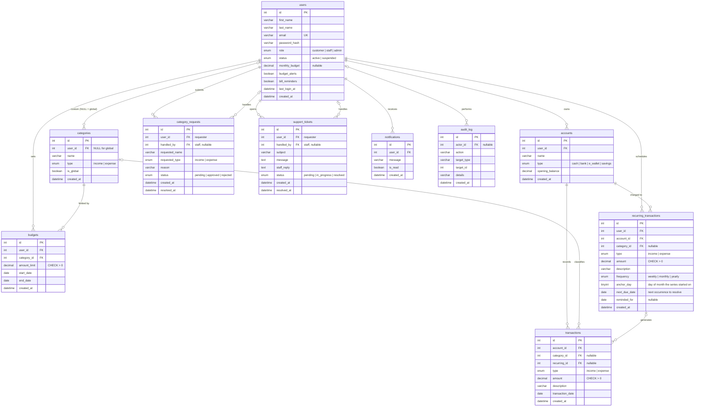

# LazyLedger — Personal Budget Web App

**Group 6 · ITS122P Final Project**

Group members:
1. AGAPITO, Raphael Lian — Database / API Developer
2. DE GUZMAN, Alyssa Mae — Project Manager
3. GRANADA, Justin Daniel — Frontend Developer
4. MAGDALUYO, Sydney Allison — Backend Developer
5. ROBLES, Nicole Joy — QA / UI / Documentation

LazyLedger helps people track income and expenses across multiple money accounts, set monthly budgets per category, and see where their money goes. Staff review category requests and support tickets; admins manage users, roles, global categories, and see system-wide reports.

## Tech stack

| Layer | Technology |
|---|---|
| Frontend | HTML5, CSS3, Bootstrap 5.3 (CDN) + custom theme, vanilla JavaScript (Fetch API), Chart.js |
| Backend | PHP 8.3, PDO, sessions, a small REST router (`src/router.php`) |
| Database | MySQL 8 (InnoDB, utf8mb4) — 9 related tables |
| External API | [Frankfurter](https://frankfurter.dev) exchange rates (PHP ⇄ USD toggle) |
| Hosting | Railway (Docker image `php:8.3-apache` + Railway MySQL) |

## Roles

| Role | Can do |
|---|---|
| **Customer** | Register/login, manage accounts (cash, bank, e-wallet, savings), add/edit/delete transactions (optionally recurring), mark upcoming bills paid / not paid, set monthly and per-category budgets, view stats, request new categories, open support tickets, get notifications, edit profile, export CSV, delete account |
| **Staff** | Approve/reject category requests, reply to and resolve support tickets, look up customer account **status** (never balances or transactions) |
| **Admin** | System dashboard & reports, create staff/admin users, change roles, suspend/restore/delete users, manage global categories, read the append-only audit log |

## Project structure

```
public/            Web root (only this folder is served)
  index.php        Landing page + login/sign-up modals
  app.php          Customer dashboard      (server-side guard: customer)
  staff.php        Staff dashboard         (server-side guard: staff)
  admin.php        Admin dashboard         (server-side guard: admin)
  api/index.php    REST API front controller — all /api/* routes
  assets/          css/, js/ (api.js helpers + one file per page), img/
src/               PHP code outside the web root
  config.php db.php session.php auth.php http.php router.php audit.php notify.php
  controllers/     One class per resource (Auth, Account, Transaction, Budget, Stats, ...)
  views/layout.php Shared <head>, dashboard shell, sidebar
database/schema.sql  Tables, keys, constraints
bin/migrate.php      Creates tables + seeds global categories and starter users (idempotent)
bin/dev-router.php   Router for PHP's built-in server (local dev without Apache)
docs/API.md          REST API reference
Dockerfile, docker/  Production image used by Railway
```

## Database (ERD)



Account balances are **computed** (`opening_balance + Σincome − Σexpense`), never stored, so they can't drift. Net worth = sum of all balances.

Recurring bills and income live in `recurring_transactions`. Each series has one open occurrence (`next_due_date`) shown under **Coming up** on Home: **Paid / Received** records a transaction and moves to the next date, **Not paid / Not received** skips it without recording anything.

## Run locally

### Option A — Docker (closest to production)
```bash
cp .env.example .env        # then set the SEED_*_PASSWORD values
docker compose up --build
```
Open http://localhost:8080. (MySQL runs inside the compose network; use `docker compose exec db mysql -ulazyledger -plazyledger lazyledger` to inspect it.)

### Option B — XAMPP / local PHP + MySQL
1. Create a database, e.g. `lazyledger`.
2. `cp .env.example .env` and fill in `MYSQL*` and `SEED_*_PASSWORD`.
3. Create tables and seed data:
   ```bash
   php bin/migrate.php
   ```
4. Start the server:
   ```bash
   php -S localhost:8000 -t public bin/dev-router.php
   ```

### Starter accounts
On first boot (empty `users` table) `bin/migrate.php` creates an admin, a staff member and a demo customer with six months of sample data, using the emails and passwords from `SEED_*` variables. A role is skipped if its password isn't set. Passwords are never committed.

## Deploy to Railway

1. Push this repository to GitHub.
2. In Railway: **New Project → Deploy from GitHub repo** and pick this repo. Railway detects the `Dockerfile`.
3. In the same project: **+ New → Database → MySQL**.
4. Open the app service → **Variables** and add:
   ```
   MYSQLHOST=${{MySQL.MYSQLHOST}}
   MYSQLPORT=${{MySQL.MYSQLPORT}}
   MYSQLUSER=${{MySQL.MYSQLUSER}}
   MYSQLPASSWORD=${{MySQL.MYSQLPASSWORD}}
   MYSQLDATABASE=${{MySQL.MYSQLDATABASE}}
   APP_ENV=production
   SEED_ADMIN_EMAIL=...        SEED_ADMIN_PASSWORD=...
   SEED_STAFF_EMAIL=...        SEED_STAFF_PASSWORD=...
   SEED_CUSTOMER_EMAIL=...     SEED_CUSTOMER_PASSWORD=...
   ```
5. App service → **Settings → Networking → Generate Domain**.
6. Deploy. On every boot the container waits for MySQL, runs `bin/migrate.php` (safe to repeat), then starts Apache on Railway's `$PORT`.

Note: Railway blocks outbound SMTP on lower plans, so the app uses in-app notifications instead of PHP `mail()`.

## Security

- Passwords hashed with `password_hash()` (bcrypt); login uses a constant-time dummy hash for unknown emails and throttles repeated failures.
- Session cookie is `HttpOnly`, `SameSite=Lax`, `Secure` over HTTPS; session ID regenerated on login; 2-hour idle timeout; suspended users are signed out on their next request.
- Every state-changing API call requires a per-session CSRF token (`X-CSRF-Token` header).
- All SQL uses PDO prepared statements with emulation **off**; sort columns are whitelisted.
- Authorization is enforced server-side on every route (`require_role`) and page (`page_guard`); every customer query is scoped to the logged-in user's own records.
- Server-side validation mirrors client-side validation (trimmed strings, positive amounts, non-negative opening balances, enums, dates, lengths).
- Output is escaped (`htmlspecialchars` in PHP, `LL.html` tagged template / `textContent` in JS); CSV exports neutralise spreadsheet formulas.
- Security headers: CSP, `X-Frame-Options: DENY`, `nosniff`, `Referrer-Policy`.
- No secrets in the repository — configuration comes from environment variables.

> ⚠️ The earlier prototype committed a Supabase database password in `api/db.php`. It is still in git history, so rotate that password or delete the Supabase project.

## API

See [docs/API.md](docs/API.md).
